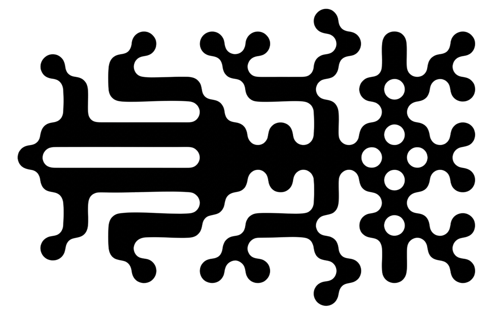
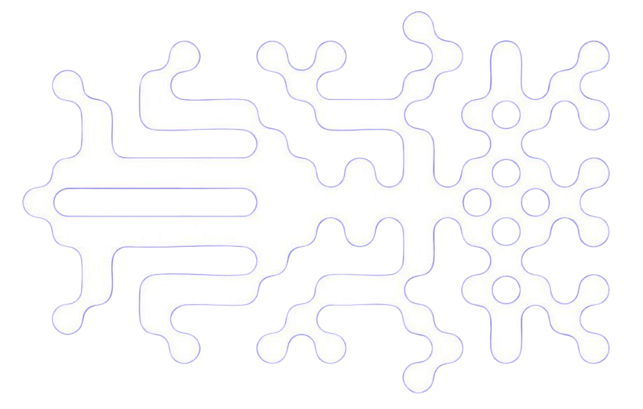
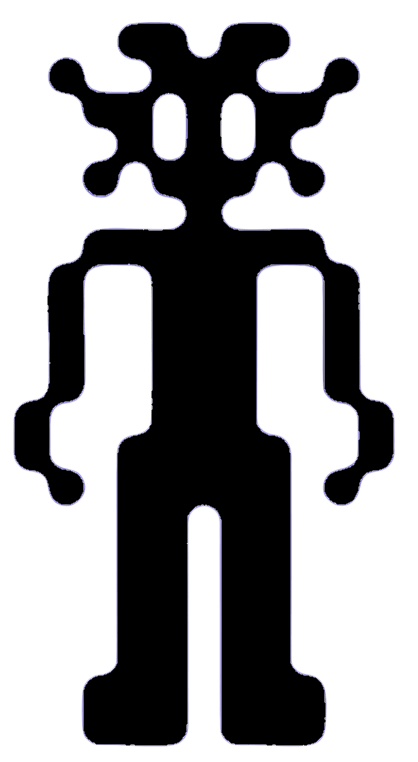
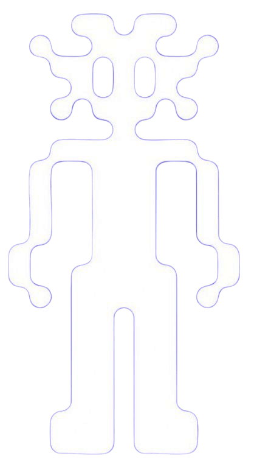

# > **:re ¿**

re as in **Reply** (*Re:*), as in **Regarding** (*Latin: in re*), as in **Zero** or **Rebirth** (*零*), and as in **King** (*Maltese: Re*).

**:re garden** - a sovereign garden of thought, where ideas return, begin again and grow into the person who tends them.

# **> garden ¿**

**:re garden**  - an online, personal knowledge base, consisting of **imperfect**, **incomplete**, **evolving** notes, ideas, and **seedling** thoughts.

these **seedlings** are updated, pruned and refined over time so they may eventually mature.

```
        o   o        v      .   .          o          *   *      v         o   o                     o    .   .
         \ /                 \ /                       \ /                  \ /        v                   \ /
     o----|----o         o----|----o      v        o----|----o          o----|----o              v     o----|----o
         / \                 / \                       / \                  / \           o                / \
    o---/   \---o      o---/   \---o    o       o---/   \---o          o---/   \---o        *   *     o---/   \---o
       / \               / \                     / \              v    / \                   \ /             / \
   o--o   o--o       o--o   o--o             o--o   o--o           o--o   o              o----|----o        o   o--o
       \ /               \ /       v             \ /         o         \ /           v       / \             \ /
        \ /               \ /                     \ /                   \ /                  \ /        v     \ /
_________|_________________|_______________________|_____________________|____________________|________________|____
```

# **> :re garden ¿**

**:re garden** ethos

<div style="display: flex; align-items: flex-start; gap: 2rem;">
  
  
  <div style="border: 3px dashed var(--gray); border-radius: 5px; padding: 1rem; min-width: 200px; min-height: 150px;">
    memetic echoes ...<br>
    of experiences never lived<br>
    <br>
    nostalgia without origin ...<br>
	fragments seeking form<br>
	<br>
    recombined here ... <br>
    the garden starts again .☘︎ ݁˖
  </div>
  
  
</div>

creature form by [Yusuf Bingöl](https://www.instagram.com/yusuf.work)
# **> whoami ¿**

**[Seth W.](https://seth-woo.github.io/)** - digital gardener and maintainer of  [**:re garden**](https://seth-woo.github.io/re-garden/).